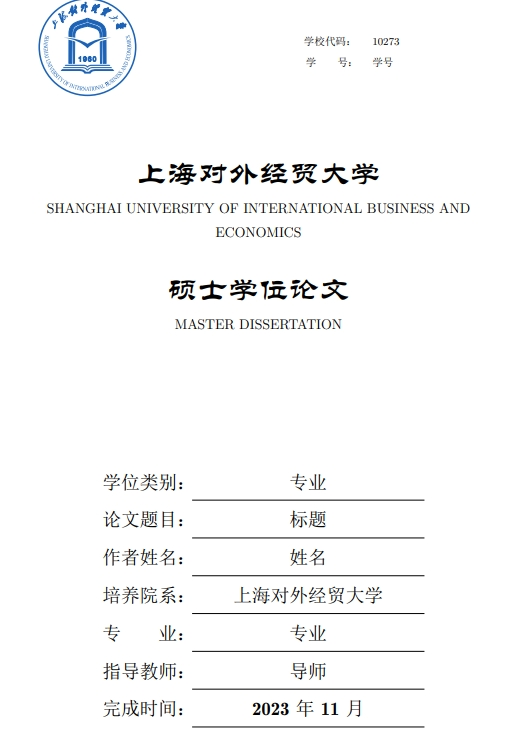
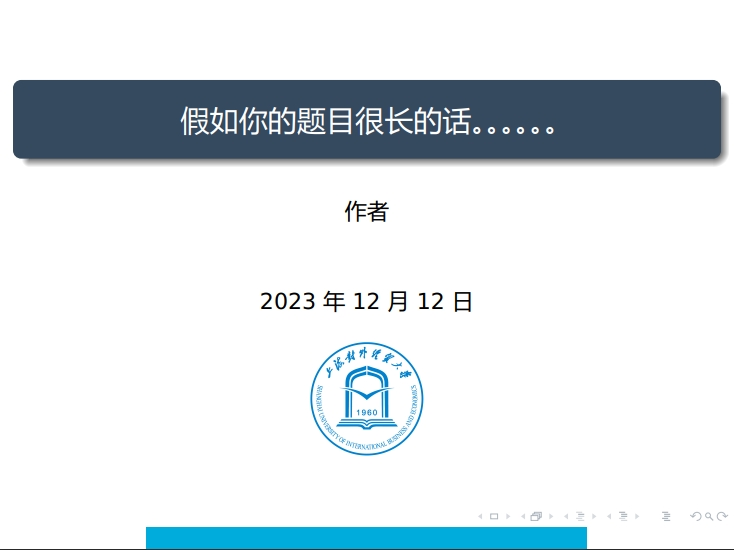

#  上海对外经贸大学PPT和Beamer模板

+ ## **overleaf(sharelatex)在线编译**

  作者已经在overleaf（sharelatex被overleaf合并了）发布了`SUIBEthesis`稳定版本，点击[overleaf链接](https://www.overleaf.com/latex/templates/suibe-thesis-template-v0-dot-1/tnydhrnnvmfc)直接进入，**overleaf**有如下优点：

  - 在线编译运行，无需本地环境
  - 云端同步，随时随地编写
  - 团队协作编写
  - 代码自动提示，包括基本语法，以及cite{}中的参考文献等

+ ## **本地编译**

  作者仅仅在textlive2021环境中测试过，请注意：

  - 务必使用`XeLaTeX`编译
  - 如果使用bibtex，并且`ref.bib`文件发生变动，则务必按照 `XeLaTeX`-->`BibTeX` --> `XeLaTeX` --> `XeLaTeX`的顺序编译，如果`ref.bib`文件未变动，则直接两次`XeLaTeX`编译。
  - 如果不使用bibtex，请将.tex文件中和bib和natbib有关的行注释掉，之后两次`XeLaTeX`编译。

+ ## Tips：如何管理参考文献库

  1. 在谷歌学术或是百度学术上搜索相关文献
  2. 将该文献的bibtex文本复制粘贴到`ref.bib`中
  3. 编译一次之后，这些参考文献便会进入你文章的文献库啦
  4. 在正文输入**cite{}**，会得到文献名称的代码提示，选择想引用的文献即可。使用到的文献会自动加入文末的**参考文献**中，一辈子只需要维护这一个`.bib`文件即可，非常方便高效(比心)。

+ # TODO:

  - [x]  参考文献算入页数
  - [x]  适配windows字体
  - [x]  嵌入中文字体
  - [x]  在sharelatex(现在的overleaf)上调试，发布在线编译版本
  - [x]  windows下编译调试
  - [x]  加入致谢
  - [x]  目录字体和标题一致
  - [x]  加入代码功能（目前只支持`python`代码的高亮，如有需要可以自行修改）
  - [ ]  (someday)参考文件前面加入方框和编号
  - [x]  参考文献中作者间隔用","而不是"and"，自制bst文件`SUIBEplainnat`
  - [x]  windows下debug，修改字体`lishu`为`lishufont`，因为和texlive2017原有函数冲突
  - [x]  因为字体版权问题，移除内嵌字体，请保证本地拥有`宋体`、`隶书`、`微软雅黑`、`楷体_GB2312`这四种字体（一般widnows电脑都有的哈)
  - [x]  移除定义新命令中的空格，否则容易出错
  - [x]  fix issues

+ ## **样章**

  论文模板：

  

​	Beamer模板：

- **作者**

  - 论文模板：[杨睿](https://github.com/Yangruipis/SUIBEthesis)
  - beamer模板：[陈颖航](https://github.com/jason51108)
  - 贡献者：[程俊彦](https://github.com/wojiaobadaye)

